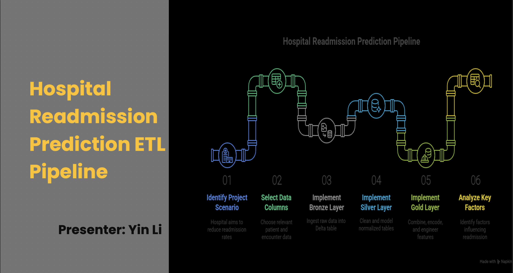

# Hospital Readmission Prediction



## Project Overview
This project implements a scalable data engineering pipeline to analyze and predict hospital readmissions. Using a **Medallion Architecture** (Bronze, Silver, Gold layers), the system processes raw patient data into analysis-ready features, enabling insights into readmission drivers such as diagnosis, age, and diabetic markers (HbA1c, Insulin).

## 🏗️ Architecture
The pipeline is built using **PySpark** and **Delta Lake**, structured into three layers:

### 1. Bronze Layer (`src/1_build_bronze.py`)
- **Ingestion**: Loads raw CSV data (`diabetic_data.csv`).
- **Storage**: Saves data as a raw Delta table (`bronze_health`).
- **Function**: Acts as the landing zone for unmodified source data.

### 2. Silver Layer (`src/2_build_silver.py`)
- **Data Cleaning**: Drops invalid records and enforces schema.
- **Normalization**: Implements a **Star Schema**:
  - **`dim_patient`**: Patient demographics (Age, Gender, Race).
  - **`fact_patient_encounter`**: Encounter details (Admissions, Lab procedures, Medications, Diagnoses).
- **Quality Checks**: Verifies uniqueness of patient IDs and presence of required columns.

### 3. Gold Layer (`src/3_build_gold.py`)
- **Feature Engineering**: Prepares data for Machine Learning.
  - **Age Bucketing**: Groups ages into 10-year intervals.
  - **Encoding**: Converts categorical variables (Race, Gender, Diagnosis) into numerical indices using `StringIndexer`.
  - **Binary Flags**: Creates flags for `readmission`, `diabetesMed`, and `change`.
  - **Derived Features**: Calculates `total_visits` (inpatient + outpatient + emergency).
- **Output**: Optimized Delta table (`gold_patient_features`) partitioned by `age` and `readmission_flag`.

## 📊 Business Analysis (`src/4_business_analyse.py`)
Key insights derived from the Gold layer:
- **Length of Stay**: Analysis of average hospital time by age group and diagnosis.
- **Readmission Risks**: Identification of diagnoses with the highest readmission rates.
- **Diabetic Indicators**: Correlation between HbA1c levels/Insulin usage and readmission probability.

## 🚀 Usage

### Prerequisites
- Python 3.8+
- PySpark
- Java 8/11 (for Spark)

### Running the Pipeline
The pipeline is designed to run locally or on Databricks.

1. **Setup Environment**:
   ```bash
   python -m venv venv
   source venv/bin/activate
   pip install -r requirements.txt
   ```

2. **Run Layers**:
   ```bash
   # Ingest raw data
   python src/1_build_bronze.py

   # Clean and normalize
   python src/2_build_silver.py

   # Engineer features
   python src/3_build_gold.py
   ```

3. **Run Analysis**:
   ```bash
   python src/4_business_analyse.py
   ```

## 📂 Project Structure
```
├── data/                   # Place diabetic_data.csv here
├── src/
│   ├── 1_build_bronze.py   # Raw -> Bronze
│   ├── 2_build_silver.py   # Bronze -> Silver (Star Schema)
│   ├── 3_build_gold.py     # Silver -> Gold (Feature Engineering)
│   └── 4_business_analyse.py # Analytics queries
├── tests/                  # Unit tests
├── README.md               # Project documentation
└── requirements.txt        # Python dependencies
```

## License
MIT
